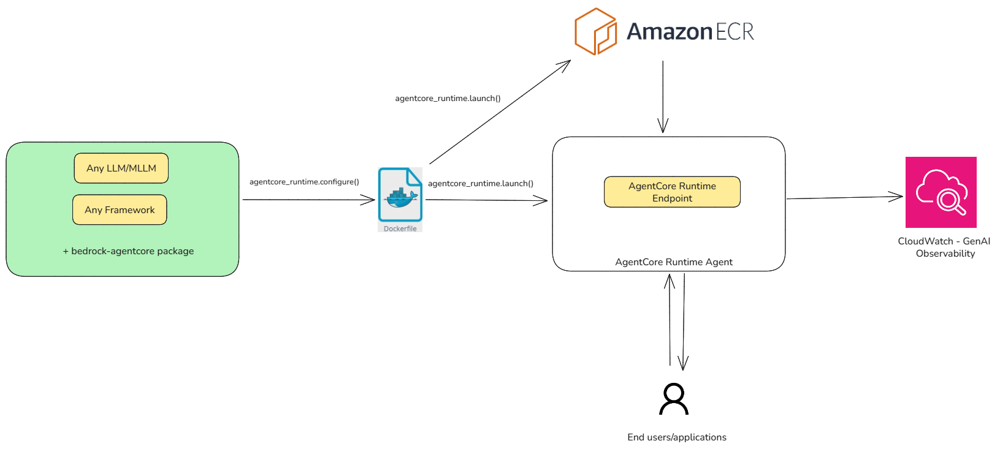
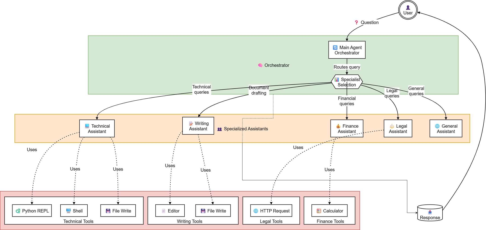
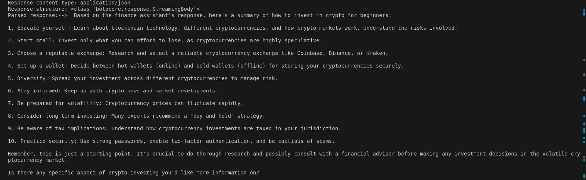

# AWS Bedrock AgentCore Runtime Setup Guide

## Overview
This guide provides step-by-step instructions for setting up and deploying an agent using AWS Bedrock AgentCore Runtime on an EC2 instance.

  
*Figure: AgentCore runtime workflow*

## The use case: A Financial Multi-Agents System:
The Financial Multi-Agents System represents a sophisticated orchestration framework designed to enhance customer service and internal operations through specialized AI assistants. At its core, the system employs an intelligent orchestrator that analyzes incoming queries and routes them to the most appropriate domain-specific assistant. This architecture features five specialized agents: a Finance Assistant for banking products and investment analyses; a Legal Assistant for regulatory compliance and contract inquiries; a Writing Assistant for professional document drafting; a Technical Assistant for IT and security concerns; and a General Assistant for miscellaneous inquiries. Each specialized agent is equipped with tailored tools—such as calculators for financial modeling, HTTP requests for legal research, document editors for content creation, and code execution environments for technical troubleshooting. This modular design ensures that complex inquiries receive expert-level responses while maintaining a seamless user experience through a unified interface. The system exemplifies Credit Agricole's commitment to leveraging advanced AI technologies to deliver precise, contextually relevant assistance across the full spectrum of banking operations.

  
*Figure: Financial Multi-Agents System*

## Prerequisites

- An EC2 instance with **arm64** architecture
- Appropriate IAM permissions for the EC2 instance
- Basic knowledge of AWS services and command line interface

## Detailed Setup Instructions

### 1. Create an EC2 Instance
Create an EC2 instance with the following specifications:
- **Instance Type**: t4g.medium (or similar arm64-based instance)
- **AMI**: Amazon Linux 2023 AMI (e.g., 2023.8.20250721.2 arm64 HVM kernel-6.1)
- **Permissions**: Ensure the instance has necessary IAM permissions for Bedrock and related services

### 2. Install Python 3.11
```bash
sudo dnf update -y
sudo dnf install -y python3.11
sudo dnf install python3-pip
```

### 3. Install UV (Python Package Manager)
```bash
pip install uv
uv init --python 3.11
uv add -r requirements.txt
```

### 4. Install Docker
For Amazon Linux 2023:
```bash
sudo dnf update -y
sudo dnf install -y docker
sudo systemctl enable docker
sudo systemctl start docker
```

### 5. Activate Python Virtual Environment
```bash
source .venv/bin/activate
```

### 6. Test the Agent Locally
```bash
uv run finance_agent.py
```

### 7. Prepare Agent for AgentCore Runtime Deployment
Modify your agent code to work with the AgentCore Runtime:

```python
# Import the Runtime App
from bedrock_agentcore.runtime import BedrockAgentCoreApp

# Initialize the App
app = BedrockAgentCoreApp()

# Decorate the invocation function
@app.entrypoint
def your_agent_function(event):
    # Your agent logic here
    return response

# Let AgentCoreRuntime control execution
if __name__ == "__main__":
    app.run()
```

### 8. Deploy the Agent
```bash
uv run step1-deploy_agent.py
```

### 9. Invoke the Deployed Agent
```bash
uv run step2-invoke_agent.py
```
  
*Figure: Final output*

### 10. Monitor Performance
After successful deployment, check the Amazon GenAI observability dashboard to monitor performance metrics of your deployed agent.

## Troubleshooting

If you encounter issues during setup:
- Verify EC2 instance architecture is arm64
- Ensure all IAM permissions are correctly configured
- Check Docker service is running properly
- Validate that all dependencies are installed in the virtual environment

## Additional Resources
- [AWS AgentCore Documentation](https://docs.aws.amazon.com/bedrock-agentcore/)
- [Amazon AgentCore GenAI Observability](https://docs.aws.amazon.com/bedrock-agentcore/latest/devguide/observability.html)